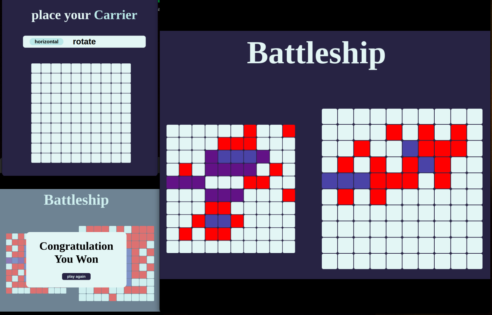

# BattleShip Game
implementation of the famous battleship game

## Live demo here 
<a href = "https://anasmustafa123.github.io/Battleship/" target = "_blank">start Battle</a>

# Learnerd 
- starting usign TDD using **jest**
- getting comforable with **transitions**
- advanced styling
- improving my problem solving 

# features to add
- [ ] adjust the computer gameplay function using an advanced ds.
- [ ] add a button for random selecting ships placment.
- [ ] adjust game over styling.
- [ ] add a save game results to a localStorage or database.
